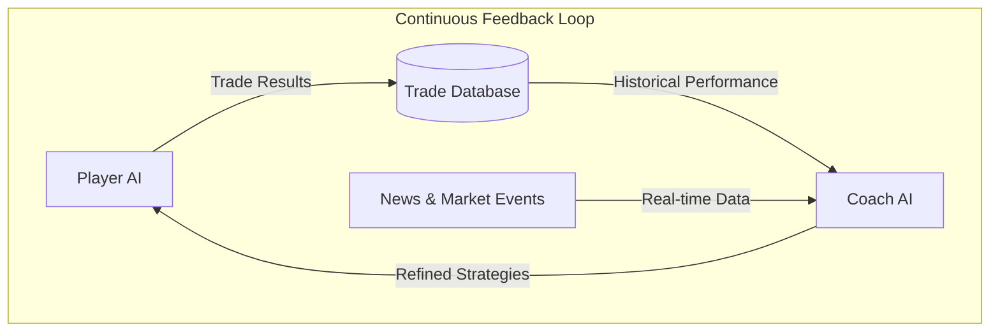
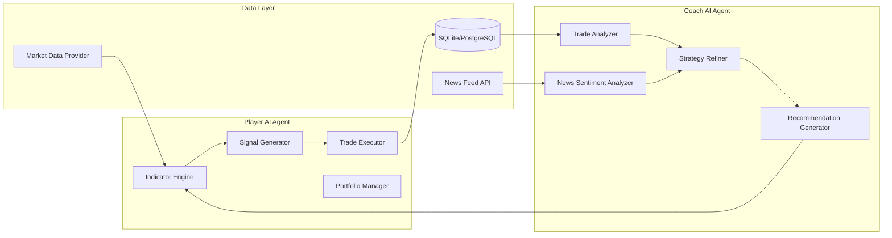
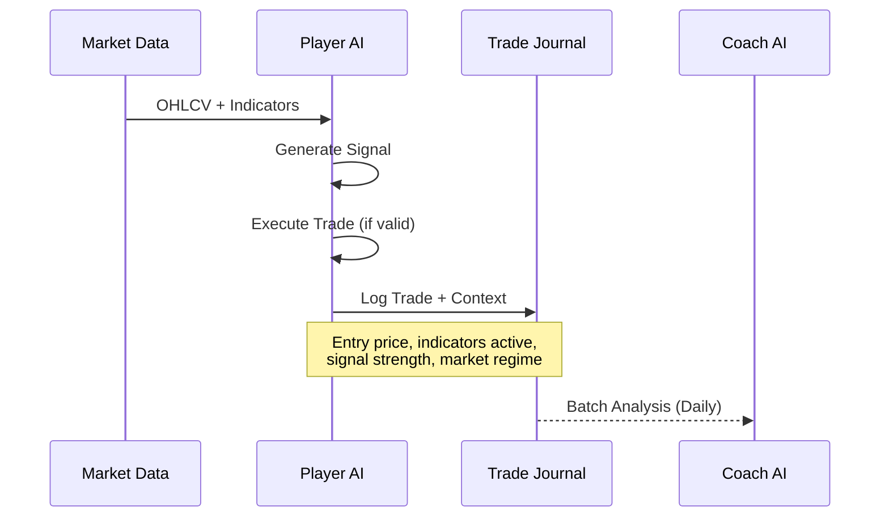
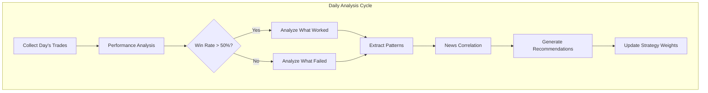
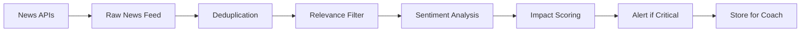
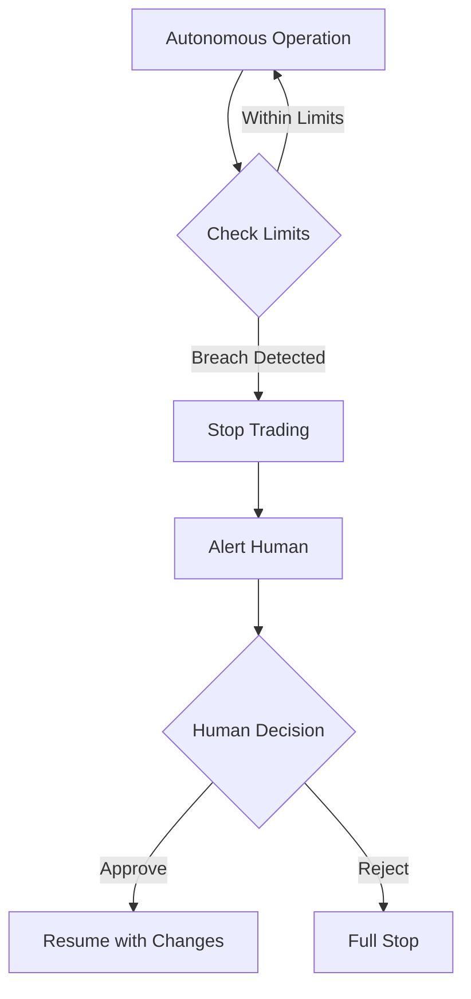
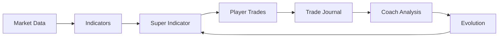
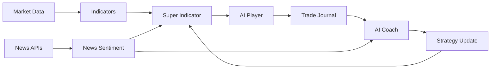

# Player-Coach AI Trading System PRD

## Product Requirements Document
**Version:** 1.0  
**Date:** January 28, 2026  
**Status:** Draft for Review

---

## Executive Summary

Transform the existing algorithmic trading system from a purely mathematical/indicator-based approach into an **autonomous, continuously learning AI trading system** using the Player-Coach model. The system will feature two independent AI agents that work in a feedback loop:

- **Player AI**: Executes trades using the existing indicator infrastructure
- **Coach AI**: Analyzes Player performance, incorporates market news/events, and refines strategies daily



---

## Problem Statement

### Current State
The existing system is a **deterministic algorithmic trading platform** that:
- Uses 40+ technical indicators with fixed, evolved weights
- Runs periodic meta-learning loops that require manual intervention
- Has a Coach that only guides genetic evolution (not continuous learning)
- Cannot adapt to breaking news, market events, or regime changes in real-time
- Requires human intervention to trigger strategy updates

### Desired State
A **fully autonomous, self-improving trading system** that:
- Learns continuously from every trade made
- Adapts strategies daily based on performance analysis
- Incorporates news sentiment and market events automatically
- Operates 24/7 without human intervention (with safety guardrails)
- Creates a true feedback loop between execution and strategy refinement

---

## Goals & Success Metrics

### Primary Goals
1. **Autonomous Operation**: System runs independently, learning and adapting
2. **Continuous Improvement**: Demonstrable improvement in key metrics over time
3. **News-Aware Trading**: Incorporate market news and events into decisions
4. **Risk-Controlled Learning**: All learning happens within safety boundaries

### Success Metrics

| Metric | Current Baseline | Target (3 months) | Target (6 months) |
|--------|-----------------|-------------------|-------------------|
| Sharpe Ratio | ~2.0 | 2.5 | 3.0 |
| Win Rate | 45% | 52% | 58% |
| Profit Factor | 1.3 | 1.6 | 2.0 |
| Max Drawdown | 30% | 20% | 15% |
| Adaptation Speed | Days | Hours | Real-time |

---

## System Architecture

### High-Level Architecture



---

## Component Specifications

### 1. Player AI Agent

> [!IMPORTANT]
> The Player AI is the **execution agent** that operates independently using the existing indicator infrastructure but with AI-driven parameter selection.

#### Responsibilities
1. **Execute trades** based on Super Indicator signals
2. **Log comprehensive trade data** for Coach analysis
3. **Manage portfolio** according to risk parameters
4. **Report performance** metrics in real-time

#### Changes from Current System

```diff
Current Player (trading_evolution/player/trader.py):
- Executes based on fixed evolved DNA weights
- No learning capability
- Batch processing only

+ New Player AI:
+ Uses LLM-powered signal interpretation
+ Real-time adjustment of entry/exit thresholds
+ Logs detailed trade context for Coach
+ Can request Coach guidance on uncertain signals
```

#### Data Flow


#### New Components for Player AI

| Component | Purpose | Technology |
|-----------|---------|------------|
| `player/ai_trader.py` | LLM-powered trade decisions | Gemini/Claude API |
| `player/context_builder.py` | Build trade context for logging | Python |
| `player/signal_interpreter.py` | AI interpretation of signals | LLM + Rules |
| `player/threshold_adjuster.py` | Dynamic threshold tuning | Reinforcement Learning |

---

### 2. Coach AI Agent

> [!IMPORTANT]
> The Coach AI is the **learning and refinement agent** that analyzes Player performance and generates improved strategies.

#### Responsibilities
1. **Analyze trade performance** across multiple dimensions
2. **Detect patterns** in winning/losing trades
3. **Monitor market news** and events via APIs
4. **Generate daily strategy refinements**
5. **Recommend indicator weight adjustments**

#### Changes from Current System

```diff
Current Coach (trading_evolution/coach/analyzer.py):
- Only analyzes during evolution runs
- No news awareness
- Outputs recommendations for genetic algorithm

+ New Coach AI:
+ Runs continuously (daily analysis cycle)
+ Ingests news via API (NewsAPI, Alpha Vantage, etc.)
+ Uses LLM to correlate news with price movements
+ Generates actionable strategy updates
+ Can pause trading during high-uncertainty events
```

#### Analysis Framework



#### New Components for Coach AI

| Component | Purpose | Technology |
|-----------|---------|------------|
| `coach/ai_analyzer.py` | LLM-powered trade analysis | Gemini/Claude API |
| `coach/news_ingester.py` | Fetch and parse market news | NewsAPI, requests |
| `coach/sentiment_analyzer.py` | Analyze news sentiment | LLM + NLP |
| `coach/strategy_updater.py` | Generate strategy updates | Python + LLM |
| `coach/feedback_loop.py` | Coordinate daily learning cycle | Scheduler |

---

### 3. News & Market Event Integration

#### Data Sources

| Source | Data Type | Update Frequency | Priority |
|--------|-----------|------------------|----------|
| NewsAPI | Headlines + Articles | Real-time | High |
| Alpha Vantage | Sector News | 15 min | Medium |
| Yahoo Finance | Company News | Real-time | High |
| Economic Calendar | Events (Fed, Earnings) | Daily | Critical |

#### News Processing Pipeline



#### News Categories & Actions

| Category | Example | Action |
|----------|---------|--------|
| **CRITICAL** | Fed Rate Decision | Pause trading, wait for clarity |
| **HIGH** | Earnings Beat/Miss | Adjust stock-specific exposure |
| **MEDIUM** | Sector Rotation News | Reweight sector allocation |
| **LOW** | General Market Commentary | Log for pattern analysis |

---

### 4. Continuous Feedback Loop

> [!TIP]
> The feedback loop is the core innovation - it enables the system to learn from every trade and improve daily.

#### Daily Learning Cycle

```mermaid
timeline
    title Daily Feedback Loop
    section Market Hours (9:15 AM - 3:30 PM IST)
        Player Executes : Trades based on current strategy
        Player Logs : Every trade with full context
    section Post-Market (4:00 PM - 6:00 PM IST)
        Coach Analyzes : Day's performance
        Coach Reviews : News and correlations
        Coach Generates : Strategy refinements
    section Pre-Market (8:00 AM - 9:00 AM IST)
        System Updates : Indicator weights
        System Validates : New strategy on holdout
        Player Receives : Updated parameters
```

#### Learning Database Schema

```sql
-- Trade journal with full context
CREATE TABLE ai_trades (
    trade_id TEXT PRIMARY KEY,
    timestamp DATETIME,
    symbol TEXT,
    direction TEXT,
    entry_price REAL,
    exit_price REAL,
    pnl REAL,
    
    -- Indicator context at entry
    indicator_snapshot JSON,
    super_indicator_value REAL,
    
    -- Market context
    market_regime TEXT,
    volatility_percentile REAL,
    
    -- News context
    news_sentiment REAL,
    relevant_headlines JSON,
    
    -- Coach analysis (filled post-trade)
    coach_analysis JSON,
    learning_extracted TEXT
);

-- Strategy versions
CREATE TABLE strategy_versions (
    version_id INTEGER PRIMARY KEY,
    created_at DATETIME,
    indicator_weights JSON,
    entry_threshold REAL,
    exit_threshold REAL,
    
    -- Performance metrics
    backtest_sharpe REAL,
    backtest_profit REAL,
    live_trades_count INTEGER,
    live_win_rate REAL,
    
    -- Coach reasoning
    change_rationale TEXT
);
```

---

### 5. Safety & Risk Controls

> [!CAUTION]
> The autonomous system must have strict safety guardrails to prevent runaway losses.

#### Risk Limits (Non-Negotiable)

| Limit | Value | Action if Breached |
|-------|-------|-------------------|
| Daily Loss Limit | 2% of capital | Stop trading for day |
| Weekly Loss Limit | 5% of capital | Stop trading, alert human |
| Strategy Drift Threshold | 30% weight change | Require human approval |
| Max Drawdown | 20% | Halt system, require reset |
| Correlation Limit | 0.8 between positions | Reduce exposure |

#### Human Oversight Triggers



---

## Implementation Phases

### Phase 1: Foundation (Weeks 1-2)
**Goal**: Build core AI infrastructure

- [ ] Create `ai_player/` module with LLM integration
- [ ] Create `ai_coach/` module with analysis capabilities
- [ ] Set up trade logging with full context
- [ ] Integrate basic news API (NewsAPI)
- [ ] Implement daily learning scheduler

**Deliverables**:
- `trading_evolution/ai_player/` - New AI-powered player module
- `trading_evolution/ai_coach/` - New AI-powered coach module
- News ingestion pipeline
- Enhanced trade journal schema

---

### Phase 2: Learning Loop (Weeks 3-4)
**Goal**: Establish continuous learning cycle

- [ ] Implement Coach analysis pipeline
- [ ] Build strategy update mechanism
- [ ] Create validation framework (backtest before deploy)
- [ ] Add sentiment analysis to news pipeline
- [ ] Connect Player to Coach recommendations

**Deliverables**:
- Working daily analysis cycle
- Automated strategy refinement
- News-aware trading decisions

---

### Phase 3: Intelligence & Optimization (Weeks 5-6)
**Goal**: Add advanced AI capabilities

- [ ] Train LLM prompts for better trade analysis
- [ ] Implement pattern detection with ML
- [ ] Add market regime classification
- [ ] Build earnings/event calendar integration
- [ ] Create performance dashboard

**Deliverables**:
- Advanced pattern detection
- Event-aware trading
- Real-time performance monitoring

---

### Phase 4: Testing & Hardening (Weeks 7-8)
**Goal**: Ensure reliability and safety

- [ ] Paper trading for 2 weeks minimum
- [ ] Stress test safety limits
- [ ] Validate learning is actually improving
- [ ] Document all components
- [ ] Create operational runbook

**Deliverables**:
- Proven system via paper trading
- Complete documentation
- Operational procedures

---

## Technical Requirements

### LLM Integration

```python
# Example: Coach analyzing a day's trades
class AICoach:
    def analyze_day(self, trades: List[Trade], news: List[NewsItem]) -> StrategyUpdate:
        prompt = f"""
        Analyze these {len(trades)} trades made today:
        {self._format_trades(trades)}
        
        Relevant market news:
        {self._format_news(news)}
        
        Current strategy weights:
        {self.current_weights}
        
        Provide:
        1. What patterns led to winning trades?
        2. What caused losing trades?
        3. Did any news correlate with price movements?
        4. Recommended indicator weight adjustments (max 10% change per indicator)
        5. Any threshold adjustments needed?
        """
        
        response = self.llm.generate(prompt)
        return self._parse_strategy_update(response)
```

### API Requirements

| API | Purpose | Rate Limit | Estimated Cost |
|-----|---------|------------|----------------|
| Google Gemini | Trade analysis, news interpretation | 60 RPM | ~$50/month |
| NewsAPI | Real-time news | 1000/day | Free tier |
| Yahoo Finance | Stock data | Unlimited | Free |
| Alpha Vantage | Economic data | 5/min | Free tier |

### Infrastructure

| Component | Specification | Purpose |
|-----------|--------------|---------|
| Python | 3.11+ | Runtime |
| SQLite → PostgreSQL | Database | Trade journal, strategy versions |
| Schedule/APScheduler | Task scheduling | Daily learning cycle |
| Redis (optional) | Caching | News deduplication |

---

## Open Questions for Review

> [!IMPORTANT]
> Please provide input on the following decisions before implementation:

1. **LLM Choice**: Should we use Gemini (already have setup) or Claude for trade analysis?

2. **News Sources**: Which news APIs should we prioritize? (NewsAPI, Alpha Vantage, Polygon.io, etc.)

3. **Learning Frequency**: 
   - Daily refinements (recommended)
   - Hourly adjustments (aggressive)
   - Weekly reviews (conservative)

4. **Safety Limits**: Are the proposed risk limits (2% daily, 5% weekly, 20% max drawdown) appropriate?

5. **Human Oversight**: How much autonomy should the system have?
   - Fully autonomous within limits
   - Require approval for strategy changes
   - Human in the loop for every trade

6. **Existing Code**: How much of the current codebase should we preserve vs. rewrite?
   - Preserve all (add AI layer on top)
   - Selective rewrite (recommended)
   - Full rewrite (risky, not recommended)

---

## Appendix: Current System Overview

### Existing Modules to Extend

| Module | Current Purpose | AI Enhancement |
|--------|-----------------|----------------|
| `player/trader.py` | Execute trades | Add AI signal interpretation |
| `coach/analyzer.py` | Analyze generations | Add continuous analysis |
| `coach/recommendations.py` | Guide evolution | Generate live strategy updates |
| `super_indicator/core.py` | Calculate signals | Dynamic weight adjustment |
| `meta_learning_loop.py` | Batch evolution | Replace with continuous loop |

### Current Data Flow


### Proposed Data Flow


---

## Next Steps

1. **Review this PRD** and provide feedback on open questions
2. **Approve implementation phases** or suggest modifications
3. **Start Phase 1** foundation work

---

*Document prepared by AI Assistant based on analysis of existing codebase and user requirements.*
